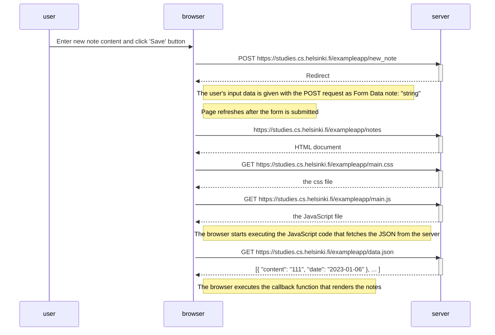

```mermaid
sequenceDiagram
    participant user
    participant browser
    participant server

        
    user->>browser: Enter new note content and click 'Save' button
    activate browser

    browser->>server: POST https://studies.cs.helsinki.fi/exampleapp/new_note
    activate server
    server-->>browser: Redirect
    deactivate server
    
    Note right of browser: The user's input data is given with the POST request as Form Data note: "string"

    Note right of browser: Page refreshes after the form is submitted
    
    browser->>server: https://studies.cs.helsinki.fi/exampleapp/notes
    activate server
    server-->>browser: HTML document
    deactivate server
    
    browser->>server: GET https://studies.cs.helsinki.fi/exampleapp/main.css
    activate server
    server-->>browser: the css file
    deactivate server
    
    browser->>server: GET https://studies.cs.helsinki.fi/exampleapp/main.js
    activate server
    server-->>browser: the JavaScript file
    deactivate server
    
    Note right of browser: The browser starts executing the JavaScript code that fetches the JSON from the server
    
    browser->>server: GET https://studies.cs.helsinki.fi/exampleapp/data.json
    activate server
    server-->>browser: [{ "content": "111", "date": "2023-01-06" }, ... ]
    deactivate server    

    Note right of browser: The browser executes the callback function that renders the notes 
```
