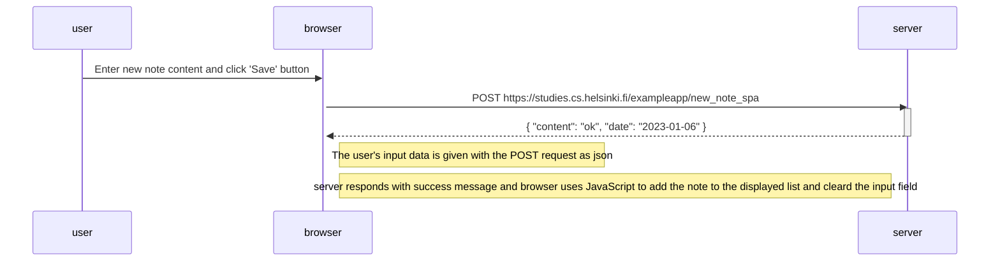

```mermaid
sequenceDiagram
    participant user
    participant browser
    participant server

        
    user->>browser: Enter new note content and click 'Save' button
    activate browser

    browser->>server: POST https://studies.cs.helsinki.fi/exampleapp/new_note_spa
    activate server
    server-->>browser: { "content": "ok", "date": "2023-01-06" }
    deactivate server
    
    Note right of browser: The user's input data is given with the POST request as json

    Note right of browser: server responds with success message and browser uses JavaScript to add the note to the displayed list and cleard the input field
```